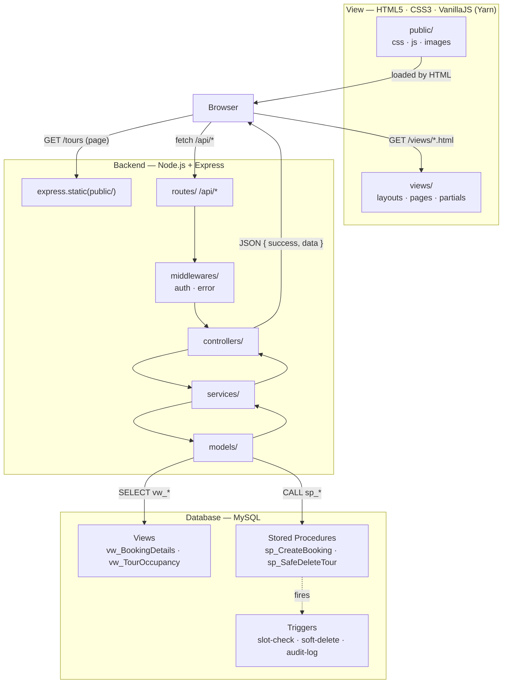
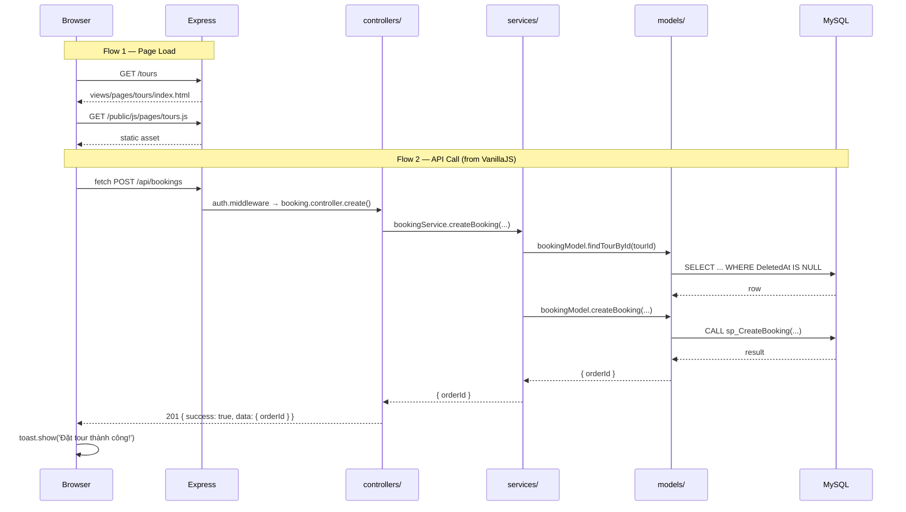
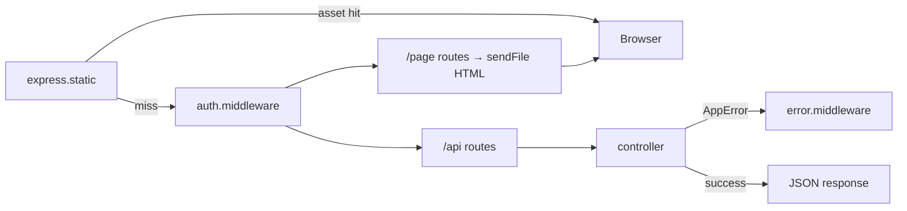

# ARCHITECTURE.md — Monolith MVC (Node.js + Express + HTML5/CSS3/VanillaJS)

---

## 1. System Overview



**Why Layer-based?** With a 3-person team and a DB-centric design (stored procedures own most business logic), grouping by layer (`controllers/`, `services/`, `models/`) is simpler to navigate than feature folders — every developer immediately knows where any type of file lives.

---

## 2. Folder Structure

```
project-root/
│
├── views/                          # V in MVC — HTML pages served by Express
│   ├── layouts/
│   │   └── base.html               # Common <head>, nav, footer shell
│   ├── partials/
│   │   ├── header.html
│   │   ├── footer.html
│   │   └── tour-card.html          # Reusable HTML snippets
│   └── pages/
│       ├── home.html
│       ├── tours/
│       │   ├── index.html          # Tour listing
│       │   └── detail.html         # Single tour + booking form
│       ├── booking/
│       │   └── confirmation.html
│       └── admin/
│           ├── dashboard.html
│           ├── tours.html
│           └── orders.html
│
├── public/                         # Static assets — served via express.static()
│   ├── css/
│   │   ├── main.css                # Global reset, variables, typography
│   │   ├── components/
│   │   │   ├── card.css
│   │   │   ├── modal.css
│   │   │   └── toast.css
│   │   └── pages/
│   │       ├── home.css
│   │       ├── tours.css
│   │       └── admin.css
│   ├── js/
│   │   ├── api/                    # Thin fetch wrappers — mirror backend routes
│   │   │   ├── booking.api.js      # POST /api/bookings, PATCH /api/bookings/:id/cancel
│   │   │   ├── tour.api.js         # GET /api/tours
│   │   │   └── admin.api.js        # Admin CRUD calls
│   │   ├── components/             # Reusable UI (no framework)
│   │   │   ├── modal.js
│   │   │   ├── toast.js
│   │   │   └── pagination.js
│   │   └── pages/                  # Page-specific entry scripts
│   │       ├── home.js
│   │       ├── tours.js
│   │       ├── tour-detail.js
│   │       └── admin/
│   │           ├── dashboard.js
│   │           └── orders.js
│   └── images/
│
├── src/                            # M + C in MVC — Node.js + Express
│   ├── controllers/                # Parse req → call service → send response
│   │   ├── booking.controller.js
│   │   ├── tour.controller.js
│   │   ├── category.controller.js
│   │   ├── analytics.controller.js
│   │   └── admin.controller.js
│   │
│   ├── services/                   # Business logic; orchestrates models
│   │   ├── booking.service.js
│   │   ├── tour.service.js
│   │   ├── category.service.js
│   │   └── admin.service.js
│   │
│   ├── models/                     # Data access — raw SQL & stored proc calls only
│   │   ├── booking.model.js
│   │   ├── tour.model.js
│   │   ├── category.model.js
│   │   ├── analytics.model.js
│   │   └── admin.model.js
│   │
│   ├── routes/                     # Express routers — wiring only
│   │   ├── index.js                # Mounts all domain routers under /api
│   │   ├── booking.routes.js
│   │   ├── tour.routes.js
│   │   ├── category.routes.js
│   │   ├── analytics.routes.js
│   │   └── admin.routes.js
│   │
│   ├── middlewares/
│   │   ├── auth.middleware.js      # JWT / session check
│   │   └── error.middleware.js     # Global error handler — MUST be last
│   │
│   ├── config/
│   │   ├── db.js                   # mysql2 connection pool
│   │   ├── constants.js            # ORDER_STATUS, TOUR_STATUS enums
│   │   └── index.js                # Single source for all process.env values
│   │
│   ├── utils/
│   │   ├── response.js             # ok() / created() / fail() envelope helpers
│   │   ├── errors.js               # AppError class
│   │   ├── asyncHandler.js         # Wraps async controllers
│   │   └── logger.js
│   │
│   ├── app.js                      # Express setup, middleware stack, route mounting
│   └── server.js                   # http.createServer + listen
│
├── package.json                    # Managed by Yarn
├── yarn.lock                       # Committed — never delete
├── .env                            # Local dev secrets — never committed
└── .env.example                    # Committed — all keys, no values
```

---

## 3. Layer Anatomy

The three MVC layers map to three root folders:

```
views/                              ← V — HTML pages & partials
public/                             ← V — CSS, JS, images (static assets)
src/                                ← M + C — Express backend
```

Within `src/`, each domain has exactly **one file per layer**:

```
src/controllers/booking.controller.js   ← HTTP boundary
src/services/booking.service.js         ← business rules
src/models/booking.model.js             ← SQL / stored procs
src/routes/booking.routes.js            ← path + middleware wiring
```

Within `public/js/`, each domain mirrors the backend:

```
public/js/api/booking.api.js        ← fetch wrapper for /api/bookings
public/js/pages/tour-detail.js      ← page entry — imports from api/ and components/
public/js/components/modal.js       ← shared UI, no page-specific logic
```

No per-domain subfolders. If a domain grows too large, split by action prefix — e.g. `booking.cancel.controller.js`.

---

## 4. Request Flow

Two distinct flows — page load and API call:



**Layer contracts:**

| Layer | Input | Output | Must NOT |
|---|---|---|---|
| `views/` | — | Static HTML loaded by browser | Contain JS logic beyond minimal inline |
| `public/js/api/` | function args | `fetch()` Promise → parsed JSON | Manipulate DOM |
| `public/js/pages/` | DOM events | Updates UI via components/ | Call backend directly (use `api/`) |
| `src/routes/` | — | Wires path → middleware → controller | Contain logic |
| `src/controllers/` | `req`, `res`, `next` | Calls service, returns `ok()`/`created()`/`fail()` | Touch DB, hold business rules |
| `src/services/` | Plain JS args | Returns plain JS object or throws `AppError` | Use `req`/`res`, write SQL |
| `src/models/` | Plain JS args | Returns raw DB result or `null` | Hold conditional logic |

---

## 5. Database Integration

The backend integrates with three DB layers defined in `DATABASE.md`:

```
models/ calls
  ├── Views          → SELECT from vw_* (analytics, catalog, occupancy)
  ├── Stored Procs   → CALL sp_* (all write operations & complex reads)
  └── Direct SQL     → simple lookups not covered by a view or SP
```

**Rule:** All write operations (`INSERT`, `UPDATE`, `DELETE`) go through a stored procedure — never raw write SQL in `models/`. This ensures DB-side transactions, trigger execution, and audit logging are never bypassed.

```js
// ✅ models/booking.model.js — write via SP
const [rows] = await db.query('CALL sp_CreateBooking(?,?,?,?,?)', [...args]);

// ✅ models/analytics.model.js — read via view
const [rows] = await db.query('SELECT * FROM vw_TourOccupancy WHERE TourName LIKE ?', [`%${title}%`]);

// ❌ raw write SQL in model
await db.query('INSERT INTO BookedTour ...'); // triggers & transactions would be skipped
```

**Soft delete:** `models/` always appends `AND DeletedAt IS NULL` on direct SELECT queries. Views already include this filter — no double-filtering needed when reading from `vw_*`.

---

## 6. Configuration Management

```js
// config/index.js — import this everywhere, never use process.env directly
module.exports = {
  app: {
    port: Number(process.env.PORT) || 3000,
    env:  process.env.NODE_ENV || 'development',
  },
  db: {
    host:     process.env.DB_HOST,
    port:     Number(process.env.DB_PORT) || 3306,
    user:     process.env.DB_USER,
    password: process.env.DB_PASSWORD,
    database: process.env.DB_NAME || 'DBMS',
  },
  auth: {
    jwtSecret: process.env.JWT_SECRET,
    jwtExpiry: process.env.JWT_EXPIRY || '1d',
  },
};
```

```
.env                  # local dev — never committed
.env.example          # committed — documents all required keys, no real values
config/index.js       # single importer of process.env
config/constants.js   # ORDER_STATUS, TOUR_STATUS — no magic numbers in code
```

---

## 7. Middleware Chain

```js
// src/app.js — order matters
app.use(express.json());
app.use(express.urlencoded({ extended: true }));
app.use(express.static(path.join(__dirname, '../public'))); // serves CSS/JS/images
app.use('/api', require('./routes'));                        // JSON API routes
app.use(require('./middlewares/error.middleware'));           // MUST be last

// Page routes — serve HTML directly
app.get('/tours',     (req, res) => res.sendFile(path.join(__dirname, '../views/pages/tours/index.html')));
app.get('/tours/:id', (req, res) => res.sendFile(path.join(__dirname, '../views/pages/tours/detail.html')));
app.get('/admin/*',   authMiddleware, (req, res) => res.sendFile(path.join(__dirname, '../views/pages/admin/dashboard.html')));
```



**`asyncHandler` is mandatory** on every async controller:

```js
// src/utils/asyncHandler.js
module.exports = (fn) => (req, res, next) =>
  Promise.resolve(fn(req, res, next)).catch(next);

// src/routes/booking.routes.js
router.post('/', auth, asyncHandler(ctrl.create));
```

**VanillaJS API convention** — all `public/js/api/` files use a shared `apiFetch` wrapper:

```js
// public/js/api/_base.js
async function apiFetch(path, options = {}) {
  const res = await fetch(`/api${path}`, {
    headers: { 'Content-Type': 'application/json' },
    ...options,
  });
  const json = await res.json();
  if (!json.success) throw new Error(json.message);
  return json.data;
}

// public/js/api/booking.api.js
async function createBooking(payload) {
  return apiFetch('/bookings', { method: 'POST', body: JSON.stringify(payload) });
}
```

---

## 8. Shared Utilities Reference

| File | Export | Usage |
|---|---|---|
| `utils/response.js` | `ok`, `created`, `fail` | All controllers — uniform JSON envelope |
| `utils/errors.js` | `AppError` | Services — throw known errors with HTTP status |
| `utils/asyncHandler.js` | `asyncHandler` | Routes — wrap every async controller |
| `utils/logger.js` | `logger.info/warn/error` | Services — structured log with timestamp |
| `config/constants.js` | `ORDER_STATUS`, `TOUR_STATUS` | Services & models — no magic numbers |
| `config/db.js` | `db` (pool) | Models only — never import in services or controllers |
