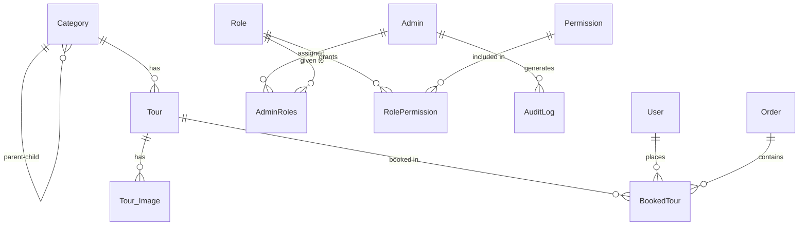

# DATABASE.md — Selling Tour Website

## Core Features

- **Tour Catalog**: `Tour`, `Tour_Image`, `Category`
- **Booking Management**: `BookedTour`, `Order`
- **Customer Management**: `User`
- **Admin & Access Control**: `Admin`, `Role`, `AdminRoles`, `Permission`, `RolePermission`, `AuditLog`

---

## 1. Overview

| Property | Value |
|---|---|
| Database | MySQL (InnoDB engine) |
| Charset | `utf8mb4` |
| Schema name | `DBMS` |
| ORM / Query builder | None — raw SQL via stored procedures & views |
| Table naming | PascalCase (`BookedTour`, `AuditLog`) |
| Column naming | PascalCase (`OrderDate`, `CostPerPerson`) |
| Reserved table | `Order` must be quoted as `` `Order` `` in queries |

---

## 2. Entities by Feature

### Feature: Tour Catalog

#### `Category`
| Column | Type | Constraints |
|---|---|---|
| CategoryID | INT | PK |
| Name | VARCHAR(255) | NOT NULL |
| CategoryThumbnail | VARCHAR(255) | |
| CategoryStatus | INT | NOT NULL — `0` = Hidden, `1` = Active |
| Description | TEXT | |
| Location | VARCHAR(255) | |
| ParentID | INT | FK → `Category(CategoryID)` (self-referencing) |

#### `Tour`
| Column | Type | Constraints |
|---|---|---|
| TourID | INT | PK |
| Title | VARCHAR(255) | NOT NULL |
| Vehicle | VARCHAR(100) | |
| Timeline | VARCHAR(255) | |
| DeparturePlace | VARCHAR(255) | |
| DepartureDate | DATETIME | |
| Duration | VARCHAR(100) | |
| CostPerPerson | DECIMAL(18,2) | |
| MaxParticipants | INT | NOT NULL |
| TourThumbnail | VARCHAR(255) | |
| TourStatus | INT | `0` = Hidden, `1` = Active |
| CategoryID | INT | FK → `Category(CategoryID)` |

#### `Tour_Image`
| Column | Type | Constraints |
|---|---|---|
| ImageID | INT | PK |
| Source | VARCHAR(255) | |
| TourID | INT | FK → `Tour(TourID)` |

---

### Feature: Booking Management

#### `` `Order` ``
| Column | Type | Constraints |
|---|---|---|
| OrderID | INT | PK |
| PaymentMethod | VARCHAR(100) | |
| OrderDate | DATETIME | |
| OrderStatus | INT | `0` = Cancelled, `1` = Pending, `2` = Completed |
| Note | TEXT | |

#### `BookedTour`
| Column | Type | Constraints |
|---|---|---|
| UserID | INT | PK (composite), FK → `User` |
| TourID | INT | PK (composite), FK → `Tour` |
| OrderID | INT | PK (composite), FK → `Order` |
| Quantity | INT | |
| PriceAtBooking | DECIMAL(18,2) | Snapshot of price at time of booking |

> **Note:** `PriceAtBooking` is intentionally denormalized — captures price at booking time, independent of future `Tour.CostPerPerson` changes.

---

### Feature: Customer Management

#### `User`
| Column | Type | Constraints |
|---|---|---|
| UserID | INT | PK |
| FullName | VARCHAR(255) | NOT NULL |
| DateOfBirth | DATE | Used for age-group analytics |
| Address | VARCHAR(255) | |
| Email | VARCHAR(100) | UNIQUE |
| Password | VARCHAR(255) | |
| PhoneNumber | VARCHAR(20) | |
| Status | INT | |

---

### Feature: Admin & Access Control

#### `Admin`
| Column | Type | Constraints |
|---|---|---|
| AdminID | INT | PK |
| FullName | VARCHAR(255) | |
| Address | VARCHAR(255) | |
| Email | VARCHAR(100) | UNIQUE |
| Password | VARCHAR(255) | |
| PhoneNumber | VARCHAR(20) | |
| Status | INT | |

#### `Role` / `AdminRoles` / `Permission` / `RolePermission`
Standard RBAC junction tables — Admin → (many) Roles → (many) Permissions.

#### `AuditLog`
| Column | Type | Constraints |
|---|---|---|
| LogID | INT | PK, AUTO_INCREMENT |
| AdminID | INT | FK → `Admin` |
| Action | VARCHAR(50) | e.g. `INSERT`, `UPDATE`, `CANCEL_ORDER` |
| TargetTable | VARCHAR(100) | |
| TargetID | INT | |
| ActionTimestamp | DATETIME | DEFAULT `CURRENT_TIMESTAMP` |
| Details | TEXT | Human-readable change summary |

---

## 3. Relationships

**Cross-feature relationships:**
- `BookedTour` links `User` (Customer feature) + `Tour` (Catalog) + `Order` (Booking)
- `AuditLog.AdminID` → `Admin`; `TargetID` is a loose reference to any table's PK (not FK-enforced)

---

## 4. Views (Computed Read Models)

| View | Purpose | Used By |
|---|---|---|
| `vw_BookingDetails` | Joins `Order` + `BookedTour`, computes `LineTotal` | Revenue SPs |
| `vw_TourOccupancy` | Seat fill rate per tour | Occupancy SP, Catalog view |
| `vw_CustomerStats` | Total orders & spending per user | VIP SP, Retention SP |
| `vw_UserDemographics` | Age-group classification | Demographics SP |
| `vw_TourCatalogue` | Active tours with seats remaining | Website frontend |
| `vw_AdminAccessControl` | Flattened admin → role → permission | Auth checks |

> **Pattern:** Views are the single source of truth for analytics. Stored procedures call views, not raw tables — keeps SPs short and logic centralized.

---

## 5. Stored Procedures

### Analytics (`SP.sql`)
| Procedure | Inputs | Returns |
|---|---|---|
| `sp_GetRevenueByDateRange` | StartDate, EndDate | Daily revenue for completed orders |
| `sp_GetRevenueByCategory` | StartDate, EndDate, CategoryName | Revenue per category |
| `sp_RevenueActualVsExpected` | StartDate, EndDate | Actual vs pending vs lost revenue |
| `sp_GetTopBestSellingToursByMonth` | Year, Month, Limit | Top N tours by customers |
| `sp_GetTourOccupancyByName` | TourTitle | Fill rate for matching tours |
| `sp_TopCancelledTours` | Limit | Top N most-cancelled tours |
| `sp_HighInventoryTours` | DaysAhead | Tours with <30% occupancy in N days |
| `GetTopVIPCustomers` | Limit, Mode (1=spend/2=orders) | Top customers |
| `GetCustomerDemographicStats` | Type (AGE/LOCATION), OrderStatus | Customer breakdown |
| `GetCustomerRetentionRate` | OrderStatus | Returning vs one-time customers |

### Transactions (`Transaction.sql`)
| Procedure | Description |
|---|---|
| `sp_CreateBooking` | Creates `Order` + `BookedTour`; triggers slot-check |
| `sp_UpdateOrderStatus` | Updates status + writes `AuditLog` |
| `sp_CancelBooking` | Sets status=0, blocks if already completed |
| `sp_CreateTourWithImage` | Atomic tour + image creation |
| `sp_SafeDeleteTour` | Deletes images first, then tour; trigger blocks if bookings exist |
| `sp_CreateAdminWithRole` | Creates admin + assigns role atomically |
| `sp_ApplyCategoryDiscount` | Bulk price reduction by % for a category |
| `sp_MergeCategories` | Moves tours to new category, deletes old one |

> **Transaction pattern:** Every write SP uses `START TRANSACTION` + `DECLARE EXIT HANDLER FOR SQLEXCEPTION BEGIN ROLLBACK; RESIGNAL; END`.

---

## 6. Triggers

| Trigger | Event | Behavior |
|---|---|---|
| `after_tour_insert` | AFTER INSERT on Tour | Writes audit log |
| `after_tour_update` | AFTER UPDATE on Tour | Logs title/price/status changes only |
| `after_tour_delete` | AFTER DELETE on Tour | Writes audit log |
| `before_tour_delete_check_booking` | BEFORE DELETE on Tour | **Blocks all hard deletes** — use `sp_SafeDeleteTour` |
| `after_category_status_update` | AFTER UPDATE on Category | Cascades status to all child tours |
| `after_category_parent_status_update` | AFTER UPDATE on Category | Cascades status to child categories |
| `before_category_delete` | BEFORE DELETE on Category | **Blocks all hard deletes** — use `sp_SoftDeleteCategory` |
| `before_user_delete` | BEFORE DELETE on User | **Blocks all hard deletes** — use `sp_SoftDeleteUser` |
| `before_bookedtour_insert_check_slots` | BEFORE INSERT on BookedTour | **Blocks** if `Quantity` exceeds remaining seats |
| `before_bookedtour_update_protected` | BEFORE UPDATE on BookedTour | **Blocks** edits on completed orders |

---

## 7. Conventions

### Primary Key Strategy
- All PKs are manually managed `INT` — **no AUTO_INCREMENT** (except `AuditLog.LogID`)
- Pattern: `SELECT COALESCE(MAX(ID), 0) + 1 INTO v_ID FROM Table FOR UPDATE`
- ⚠️ Race-condition risk under high concurrency — consider migrating to `AUTO_INCREMENT` or UUIDs

### Status Enums
| Entity | Column | Values |
|---|---|---|
| Order | OrderStatus | `0`=Cancelled, `1`=Pending, `2`=Completed |
| Tour | TourStatus | `0`=Hidden, `1`=Active |
| Category | CategoryStatus | `0`=Hidden, `1`=Active |
| User / Admin | Status | Application-defined |

### Soft Delete
- **Implemented** on `Tour`, `Category`, `User`, `Admin` via a `DeletedAt DATETIME NULL DEFAULT NULL` column.
- `NULL` = active record; a timestamp = soft-deleted.
- All views (`vw_BookingDetails`, `vw_TourOccupancy`, `vw_CustomerStats`, `vw_UserDemographics`, `vw_TourCatalogue`, `vw_AdminAccessControl`) filter `WHERE DeletedAt IS NULL` automatically.
- **Hard deletes are blocked** by BEFORE DELETE triggers on `Tour`, `Category`, and `User` — any direct `DELETE` statement raises a `SQLSTATE 45000` error.
- All deletions must go through the designated stored procedures:

| Operation | Procedure | Restore Procedure |
|---|---|---|
| Delete tour | `sp_SafeDeleteTour(TourID, AdminID)` | `sp_RestoreTour(TourID, AdminID)` |
| Delete category | `sp_SoftDeleteCategory(CategoryID, AdminID)` | `sp_RestoreCategory(CategoryID, AdminID, RestoreTours)` |
| Delete user | `sp_SoftDeleteUser(UserID, AdminID)` | *(manual UPDATE)* |

- **Cascade rules:**
  - Soft-deleting a `Category` → cascades `DeletedAt` to all its `Tour` rows and child `Category` rows.
  - Soft-deleting a `Tour` blocked if it has **pending** (`OrderStatus = 1`) bookings; completed orders are preserved for audit.
  - `sp_RestoreCategory` accepts a `p_RestoreTours TINYINT` flag — pass `1` to also restore tours in that category.

### Timestamps
- `Order.OrderDate` — set via `NOW()` in `sp_CreateBooking`
- `AuditLog.ActionTimestamp` — `DEFAULT CURRENT_TIMESTAMP`
- No `created_at` / `updated_at` on Tour or User tables

### Price Snapshot
- `BookedTour.PriceAtBooking` stores the price at time of booking, decoupled from `Tour.CostPerPerson`

---

## 8. Migration Rules

| Rule | Detail |
|---|---|
| File naming | `V<number>__<short_description>.sql` — e.g. `V1__create_tables.sql` |
| Execution order | `V1__create_tables.sql` → `view.sql` → `trigger.sql` → `SP.sql` → `Transaction.sql` → `V2__add_soft_delete.sql` |
| Destructive changes | Always wrap in a transaction with a rollback test before applying to production |
| Adding columns | Use `ALTER TABLE ... ADD COLUMN` with a DEFAULT to avoid locking issues |
| Rollback policy | Keep a paired `V<number>__rollback_<description>.sql` for every structural migration |
| No tool enforced | Team manually tracks versions — recommend adopting Flyway or Liquibase |
